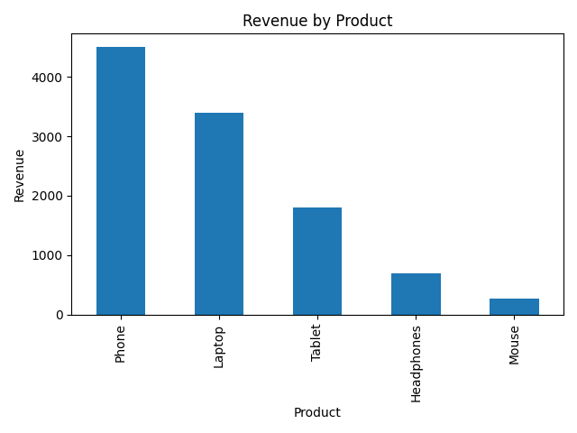
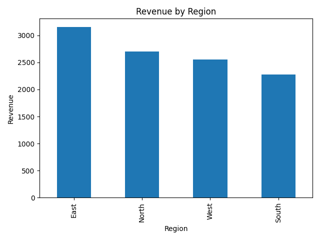
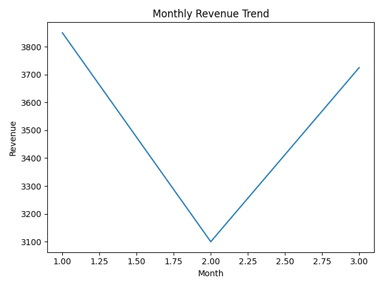

# Sales Performance Dashboard (Power BI Project)

## 📊 Project Overview
This project focuses on analyzing sales data to uncover key business insights such as revenue trends, regional performance, and top-performing products.  
The goal is to transform raw data into a clear and interactive dashboard that supports better business decision-making.

---

## 🎯 Business Problem
Businesses need to understand:
- Which products generate the most revenue
- Which regions perform best
- How revenue changes over time

This project solves that by building a dashboard that provides quick and actionable insights.

---

## 🛠️ Tools & Technologies
- Power BI  
- Python (Pandas, Matplotlib)  
- CSV Dataset  
- VS Code  

---

## 🧹 Data Cleaning & Preparation
- Loaded dataset using Python (Pandas)
- Created a *Revenue column (Quantity × Price)*
- Converted Date column to datetime format
- Extracted Month for trend analysis
- Verified and structured data for visualization

---

## 📈 Dashboard Features
- *Revenue Trend (Line Chart)* → shows monthly performance  
- *Revenue by Region (Bar Chart)* → compares regional performance  
- *Top Products by Revenue (Horizontal Bar Chart)* → ranks products  
- *Interactive Filters (Slicers)*:
  - Month  
  - Region  
  - Product  
- *KPI Cards*:
  - Total Revenue  
  - Total Orders  
  - Average Order Value  
  - Total Quantity  

---

## 🔍 Key Insights
- 📌 *Phone* is the top-performing product (~4.5K revenue)  
- 📌 *East region* generates the highest revenue (~3.2K)  
- 📌 Revenue dropped in *February* but increased again in *March*  
- 📌 Sales show an overall positive trend from January to March  

---

## 💡 Recommendations
- Increase marketing efforts for high-performing products like *Phones*  
- Focus expansion strategies on top-performing regions such as the *East*  
- Investigate factors behind February’s dip and March’s recovery  
- Replicate strategies that led to increased revenue in March  

---

## 🖼️ Dashboard Preview

---

## 📊 Visualizations

### Revenue by Product

### Revenue by Region

### Monthly Revenue Trend

- Sales-performance-dasboard.pbix → Power BI dashboard file
- Sales-dashboard-preview.png → Main dashboard screenshot
- Sales.csv → Dataset
- sales_analysis.py → Python analysis script
- monthly_chart.png → Monthly revenue trend chart
- product_chart.png → Product revenue chart
- region_chart.png → Regional revenue chart

---

## 🚀 Conclusion
This project demonstrates how raw data can be transformed into meaningful insights using data analysis and visualization tools.  
It highlights key business trends and supports data-driven decision-making.
