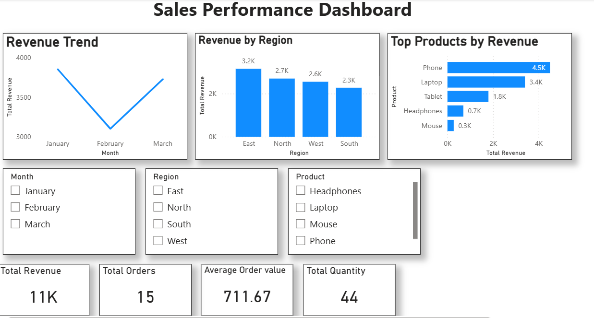

# 📊 Sales Performance Analysis Dashboard

## 📌 Overview
This project analyzes sales data to identify revenue trends, top-performing products, and regional performance. The goal is to generate actionable insights that support better business decisions.

## 🛠 Tools Used
- Python (Pandas, Matplotlib)
- Power BI
- Excel / CSV Dataset

## 📊 Key Analysis
- Revenue calculation (Quantity × Price)
- Monthly sales trend analysis
- Product performance comparison
- Regional sales analysis

## 📈 Key Insights
- Phones generated the highest revenue among all products  
- The East region showed the strongest overall performance  
- Sales increased steadily from January to March  
- Certain months showed higher demand, indicating seasonal trends  

## 📁 Project Files
- sales.csv – Raw dataset  
- analysis.py – Python data analysis script  
- Power BI Dashboard (visual analysis)

## 📊 Dashboard Preview
<!-- Add your Power BI screenshot below -->

## 🚀 Outcome
This project demonstrates the ability to clean, analyze, and visualize data to generate business insights that support decision-making.
